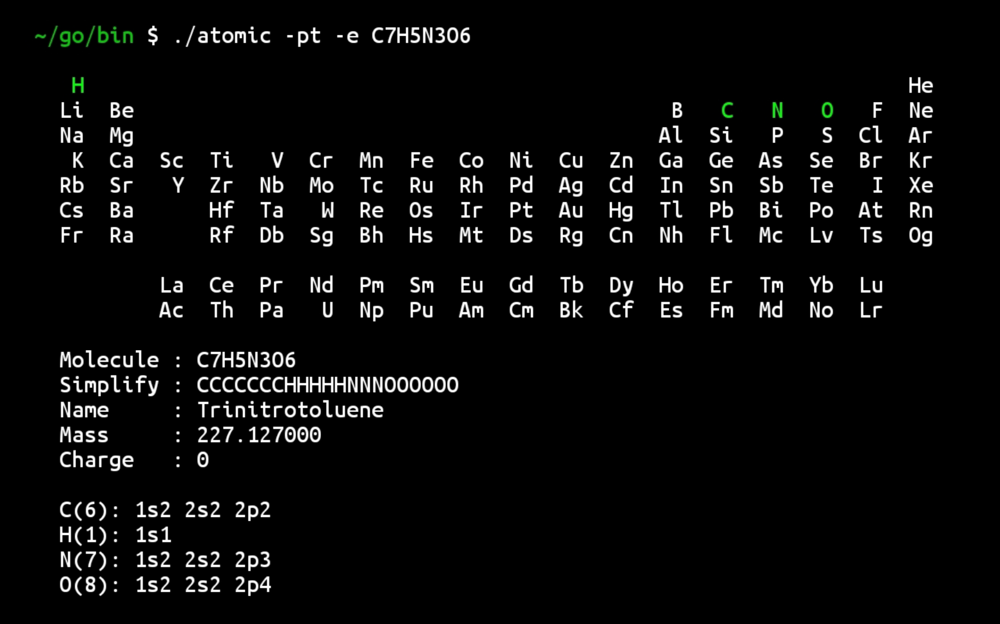

# ATOMIC

A command-line tool to parse chemical formulas, draw the periodic table, and display electron configurations.


## Features

- Parse chemical formulas and display relevant information, such as molecular mass, charge, and state.
- Draw the periodic table.
- Display electron configurations of the elements in the formula.


## Usage

```bash
atomic [options] <formula>
```

### Options

- `-pt` : Draw the periodic table with the elements involved in the provided formula.
- `-e`  : Show electron configurations of the elements in the provided formula.

### Examples

1. **Parse a formula** and show details:

    ```bash
    atomic NaCl
    ```

    Output:
    ```
	Molecule : NaCl
	Simplify : NaCl
	Name     : Sodium Chloride
	Mass     : 58.443000
	Charge   : 0
    ```

2. **Draw the periodic table** and show the electron configurations:

    ```bash
    atomic -pt -e NaCl
    ```

    Output:
    

## Data

- Elements data is loaded from `data/elements.csv`.
- Molecules data is loaded from `data/molecules.csv`.

## Requirements

- Go 1.16 or later

## Installation

1. Clone the repository:

    ```bash
    git clone https://github.com/mahdin-hc/atomic.git
    ```

2. Build the executable:

    ```bash
    go build -o atomic.exe
    ```

3. Run the tool:

    ```bash
    atomic.exe -e -pt NaCl
    ```
